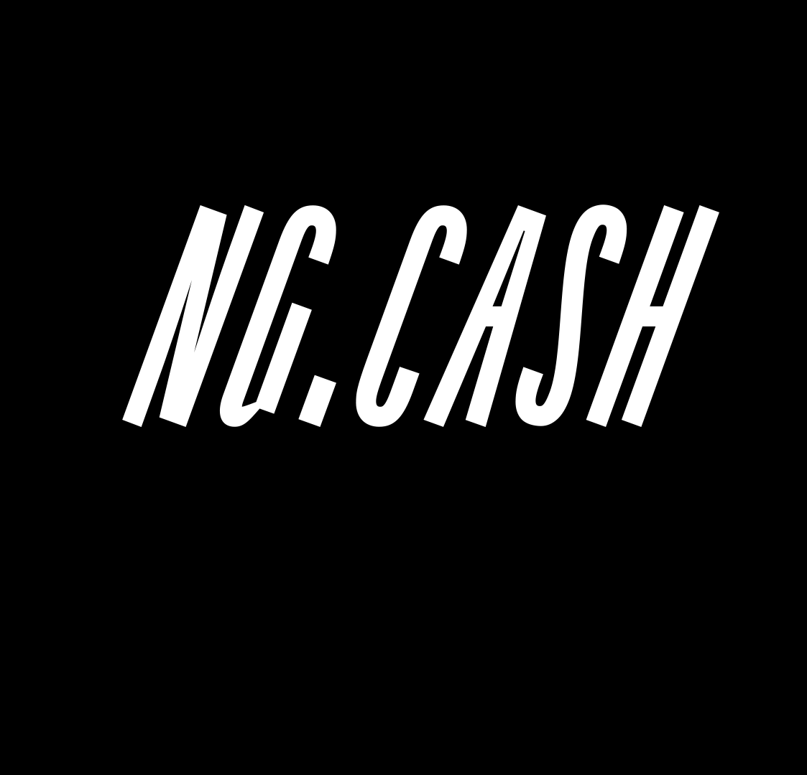
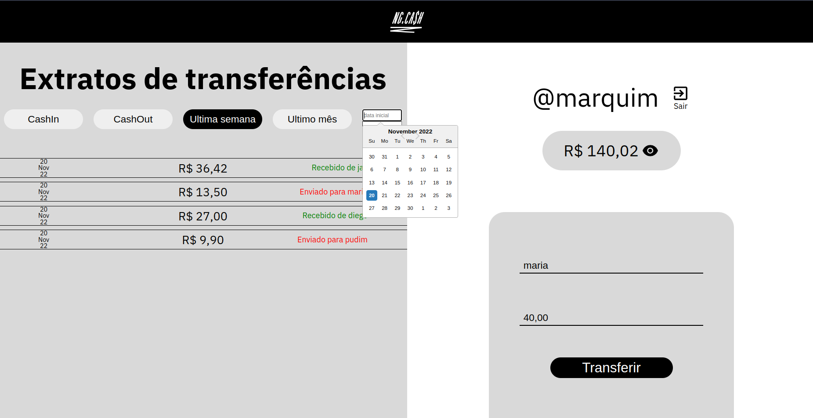
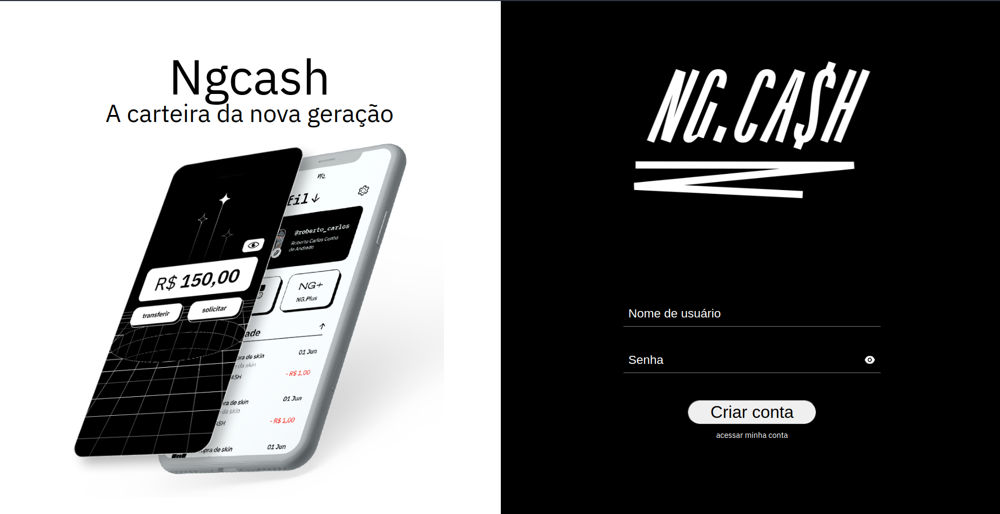

# NGCASH

<p align="center">
   
</p>


- Este projeto é inspirado na [NGCASH](https://ng.cash/), uma plataforma com o propósito de levar o controle e independência da vida financeira as novas gerações
- Você pode fazer o login com um nome de usuário e senha e começar a fazer suas transferências para outros usuários da aplicação

- [veja meu deploy na Vercel aqui](https://ngcash-front-end.vercel.app/)
- [veja meu repositório back end dessa aplicação aqui](https://github.com/marcojr73/ngcash-back-end)

***

## Demonstração

<p align="center">
   
   
</p>

## Como usar

Instale meu projeto e suas dependências

```bash
  git clone git@github.com:marcojr73/ngcash-front-end.git
```

```bash
  npm install
  
  npm run dev
```

***

## Docker

- Com o docker você pode rodar o ambiente sem precisar instalar nenhum programa
- O front end estará disponivel na porta 5173,
- Basta executar o comando na raiz do projeto

```bash
  npm run docker:build

  npm run docker:run
```

***


##	 Tecnologias e Conceitos

- React
- Typescript
- Context API
- LocalStorage
- Toasts (react-toastify) 
- styled-Componentes
- React loader
- Date picker
- Display responsivo
- Docker
***
    